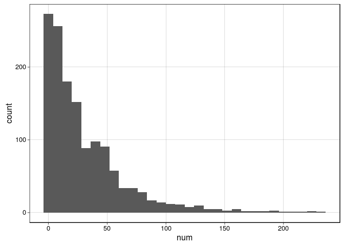
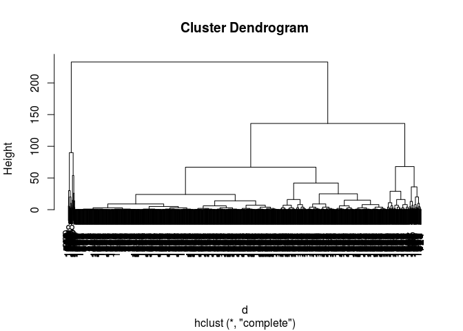

# View the data
Andrey Ziyatdinov  
`r Sys.Date()`  


```r
library(plyr)
library(ggplot2)
library(gridExtra)

library(pander)

library(data.table)
```


```r
theme_set(theme_linedraw())
panderOptions('table.split.table', Inf)
panderOptions('knitr.auto.asis', FALSE)
```

# Data


```r
accidents <- fread("~/git/variani/acndatathon/data/accidents.csv", data.table = F)
weather <- fread("~/git/variani/acndatathon/data/BCNweather-201001-201601.csv", data.table = F)
grid <- fread("~/git/variani/acndatathon/data/city-grid.csv", data.table = F)
holidays <- fread("~/git/variani/acndatathon/data/holidays.csv", data.table = F)
people <- fread("~/git/variani/acndatathon/data/people-involved.csv", data.table = F)
test <- fread("~/git/variani/acndatathon/data/test.csv", data.table = F)
cause <- fread("~/git/variani/acndatathon/data/type-cause.csv", data.table = F)
```

## Cleaning

### Dates


```r
test <- mutate(test,
  Date = as.Date(date)) 
```


```r
accidents <- mutate(accidents,
  year = substr(accidents$date, 1, 4))
```


```r
out <- ldply(strsplit(accidents$date, "-"), function(x) {
 x2 <- x[2]
 x3 <- x[3]

 x2month <- suppressWarnings(is.na(as.numeric(x2)))
 x3month <- suppressWarnings(is.na(as.numeric(x3)))
 
 data.frame(x2 = x2, x3 = x3, x2month = x2month, x3month = x3month, stringsAsFactors = F) 
})
stopifnot(sum(diag(table(out$x2month, out$x3month))) == 0)
```


```r
out <- mutate(out,
  month = ifelse(x2month, x2, x3),
  day = as.numeric(ifelse(x2month, x3, x2)))
```


```r
out$month <- laply(out$month, function(x) which(month.name == x))
```


```r
accidents$year <- as.numeric(accidents$year)
accidents$month <- as.numeric(out$month)
accidents$day <- as.numeric(out$day)
```

Check the produced numeric vectors are OK.


```r
table(accidents$year)
```

```

2010 2011 2012 2013 2014 
9056 8831 9253 9457 9680 
```

```r
table(accidents$month)
```

```

   1    2    3    4    5    6    7    8    9   10   11   12 
3679 3802 4005 3813 4085 3942 4095 2809 3738 4163 4109 4037 
```

```r
table(accidents$day)
```

```

   1    2    3    4    5    6    7    8    9   10   11   12   13   14   15 
1404 1383 1531 1533 1633 1429 1422 1480 1440 1626 1616 1531 1538 1562 1555 
  16   17   18   19   20   21   22   23   24   25   26   27   28   29   30 
1529 1494 1570 1650 1519 1548 1615 1593 1316 1482 1523 1503 1534 1396 1465 
  31 
 857 
```

Create Dates:


```r
accidents <- mutate(accidents,
  Date = as.Date(paste(year, month, day, sep = "-")))
```

### Weekdays


```r
add_weekday <- function(dat)
{
  dat <- mutate(dat,
    weekday = weekdays(Date))
  
  dat$weekday <- factor(dat$weekday, ordered = TRUE, levels = c("Sunday", "Saturday", "Monday", "Tuesday", "Wednesday", "Thursday", "Friday"))
  dat$weekdayNum <- as.numeric(dat$weekday)
  
  return(dat)
}
```


```r
accidents <- add_weekday(accidents) 
test <- add_weekday(test) 
```


```r
table(accidents$weekday, accidents$weekdayNum)
```

```
           
               1    2    3    4    5    6    7
  Sunday    3786    0    0    0    0    0    0
  Saturday     0 4996    0    0    0    0    0
  Monday       0    0 7077    0    0    0    0
  Tuesday      0    0    0 7274    0    0    0
  Wednesday    0    0    0    0 7541    0    0
  Thursday     0    0    0    0    0 7541    0
  Friday       0    0    0    0    0    0 8062
```


## Plots

### Shift


```r
sf <- ddply(accidents, "Shift", summarize, num = length(ID)) 
ggplot(sf, aes(Shift, num)) + geom_bar(stat = "identity") 
```

 

### Weekday


```r
sf <- ddply(accidents, "weekday", summarize, num = length(ID)) 
ggplot(sf, aes(weekday, num)) + geom_bar(stat="identity") 
```

 

### Date 


```r
sf <- ddply(accidents, "Date", summarize, num = length(ID))
ggplot(sf, aes(Date, num)) + geom_bar(stat="identity")
```

 


```r
ggplot(sf, aes(num)) + geom_histogram()
```

 

### GridID


```r
df <- subset(accidents, !is.na(GridID))
sf <- ddply(df, "GridID", summarise, num = length(ID))
```


```r
ggplot(sf, aes(num)) + geom_histogram()
```

 

### Weather

Cut value could be 25.


```r
qplot(train$meanWindSpeedKmh) + xlim(c(1, 50))
```

 

Cut value (lower tail) could be 40.


```r
qplot(train$meanHumidity)
```

 

Cut value (lower tail) could be 0.


```r
qplot(train$meanDewPoint)
```

 


```r
qplot(train$meanTemperatureC)
```

 


## Explore grid


```r
grid <- subset(grid, !is.na(GridID))

df <- subset(accidents, !is.na(GridID))
sf <- ddply(df, "GridID", summarise, num = length(ID))

grid <- join(grid, sf, by = "GridID")
grid <- within(grid,
  num[is.na(num)] <- 0)

stopifnot(!any(is.na(grid$num)))
```


```r
X <- grid[, -1]
Y <- grid[1]

d <- dist(X)
```


```r
out <- hclust(d)
```


```r
plot(out)
```

 


```r
y <- cutree(out, 50)
```


```r
grid$GridID2 <- as.factor(y)
```

## Wheather


```r
weather <- mutate(weather,
  Date = as.Date(DateCET))

weather <- add_weekday(weather)
```


```r
sf <- ddply(weather, "Date", summarise, num = length(Date))
```


```r
ggplot(sf, aes(num)) + geom_histogram()
```

 

### Summary weather


```r
sweather <- ddply(weather, "Date", summarize,
  meanTemperatureC = mean(TemperatureC, na.rm = TRUE),
  meanDewPoint = mean(DewPoint, na.rm = TRUE),
  meanHumidity = mean(Humidity, na.rm = TRUE),
  meanWindSpeedKmh = mean(as.numeric(WindSpeedKmh), na.rm = TRUE),
  allConditions = paste(names(table(Conditions)), as.numeric(table(Conditions)), collapse = "|")
)
```


```r
wd <- unique(sweather$Date)
```


```r
table(accidents$Date %in% wd)
```

```

 TRUE 
46277 
```

```r
table(test$Date %in% wd)
```

```

   TRUE 
1582275 
```


## Explore test


```r
range(test$date) 
```

```
[1] "2015-01-01" "2015-12-31"
```

# Create train / test


```r
train <- join(accidents, sweather)
test <- join(test, sweather)

test <- mutate(test, 
  month = month(Date),
  year = year(Date))
```


```r
train <- mutate(train, ShiftFac = factor(Shift, levels = c("Night", "Morning", "Afternoon"), ordered = TRUE))
test <- mutate(test, ShiftFac = factor(Shift, levels = c("Night", "Morning", "Afternoon"), ordered = TRUE))
```


```r
train <- join(train, subset(grid, select = c("GridID", "Longitude.grid", "Latitude.grid", "GridID2")))
test <- join(test, subset(grid, select = c("GridID", "Longitude.grid", "Latitude.grid", "GridID2")))
```


```r
train <- mutate(train, dm = substr(Date, 6, 12))
test <- mutate(test, dm = substr(Date, 6, 12))
```


```r
add_whether_bin <- function(dat)
{
  dat <- mutate(dat,
    meanWindSpeedKmhBin = factor(as.numeric(meanWindSpeedKmh > 25)),
    meanHumidityBin = factor(as.numeric(meanHumidity < 40)),
    meanDewPointBin = factor(as.numeric(meanDewPoint < 0)))
}    

train <- add_whether_bin(train)
test <- add_whether_bin(test)
```


```r
sf <- ddply(train, c("dm", "Shift", "GridID2"), summarise,
  acc = length(Date) / 5)
```


```r
dates <- data.frame(date = seq(as.Date("2010-01-01"), as.Date("2010-12-31"), "days"))

df <- expand.grid(Date = dates$date,
  Shift = unique(train$Shift),
  GridID2 = na.omit(unique(grid$GridID2)),
  stringsAsFactors = F)
```


```r
df <- mutate(df, dm = substr(Date, 6, 12))
```


# Write csv


```r
vars <- c("Date", "Shift", "ShiftFac", "GridID", "GridID2",
  "weekday", "weekdayNum", "dm", "month", "year",
  "meanWindSpeedKmhBin", "meanHumidityBin", "meanDewPointBin")

write.csv(subset(train, select = vars), file = "train.csv", row.names = F)
write.csv(subset(test, select = vars), file = "test.csv", row.names = F)
```


```r
train2_accidents <- fread("train2_accidents.csv", data.table = F)
train2_no_accidents <- fread("train2_no_accidents.csv", data.table = F)
```


```r
dat <- fread("train2_no_accidents_p4.csv", data.table = F)

dat$Date <- as.Date(dat$date)
dat <- add_weekday(dat)
dat <- join(dat, sweather)

dat <- join(dat, subset(grid, select = c("GridID", "Longitude.grid", "Latitude.grid", "GridID2")))

dat <- mutate(dat, 
  month = month(Date),
  year = year(Date))

write.csv(dat, file = "test2.csv", row.names = F)

train2_accidents <- dat
```


```r
write.csv(train2_accidents, file = "train2_accidents2.csv", row.names = F)
```
